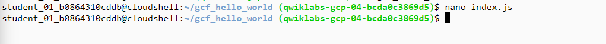
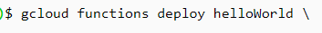

# Cloud Functions: Command Line
Cloud Functions is a serverless execution environment for building and connecting cloud services. With Cloud Functions you write simple, single-purpose functions that are attached to events emitted from your cloud infrastructure and services. Your Cloud Function is triggered when an event being watched is fired. Your code executes in a fully managed environment. There is no need to provision any infrastructure or worry about managing any servers.
## Create a function
Create a directory for the function code.
  
`mkdir gcf_hello_world`

Move to the `gcf_hello_world` directory.

`cd gcf_hello_world`




Create and open `index.js` to edit.

`nano index.js`
Copy the following into the `index.js` file
```
/**
* Background Cloud Function to be triggered by Pub/Sub.
* This function is exported by index.js, and executed when
* the trigger topic receives a message.
*
* @param {object} data The event payload.
* @param {object} context The event metadata.
*/
exports.helloWorld = (data, context) => {
const pubSubMessage = data;
const name = pubSubMessage.data
    ? Buffer.from(pubSubMessage.data, 'base64').toString() : "Hello World";
console.log(`My Cloud Function: ${name}`);
```
Exit nano (Ctrl+x) and save (Y) the file.

## Create a cloud storage bucket

`gsutil mb -p [PROJECT_ID] gs://[BUCKET_NAME]`


## Deploy your function

Deploy the function to a pub/sub topic named h`ello_world`, replacing [BUCKET_NAME] with the name of your bucket:

```
gcloud functions deploy helloWorld \
  --stage-bucket [BUCKET_NAME] \
  --trigger-topic hello_world \
  --runtime nodejs8

```



If prompted, enter Y to allow unauthenticated invocations of a new function.

Verify the status of the function.

`gcloud functions describe helloWorld`


## Test the function
`DATA=$(printf 'Hello World!'|base64) && gcloud functions call helloWorld --data '{"data":"'$DATA'"}'`


## View logs

`gcloud functions logs read helloWorld`


